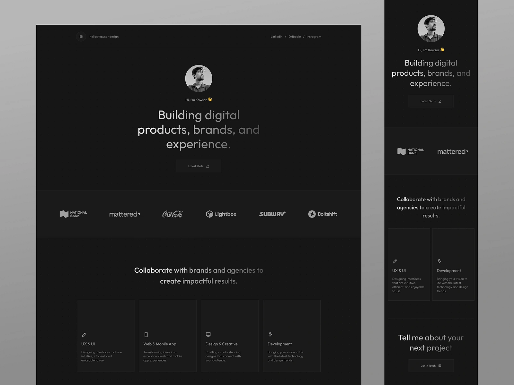

# portfolio-


## Installation

To get started with this project, follow these steps:

1. **Clone the repository:**
    ```sh
    git clone https://github.com/anamolhasan/portfolio-.git
    cd portfolio-
    ```

2. **Install dependencies:**
    ```sh
    npm install
    ```

3. **Start the development server:**
    ```sh
    npm run dev
    ```

## Technologies Used

- **Vite** - Next Generation Frontend Tooling
- **React** - A JavaScript library for building user interfaces
- **Tailwind CSS** - A utility-first CSS framework
- **Framer Motion** - A production-ready motion library for React

## Project Structure

```plaintext
├── public
│   └── ...
├── src
│   ├── assets
│   ├── components
│   ├── pages
│   ├── App.jsx
│   ├── main.jsx
│   └── ...
├── .gitignore
├── index.html
├── package.json
├── postcss.config.js
├── tailwind.config.js
└── vite.config.js
```

## License

This project is licensed under the MIT License.